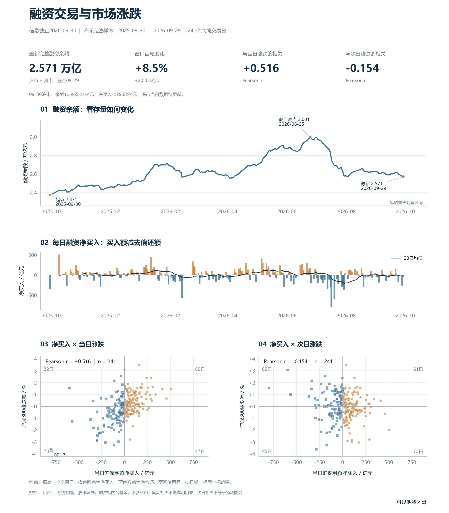

# 融资净买入与市场涨跌：把当日和次日分开看

本版信息截止2026-09-30。9月30日沪市融资余额12,965.21亿元，净买入-229.62亿元；深市当天数据暂缺。沪深合计使用2025-09-30至2026-09-29的241个完整交易日，次日收益已观察到9月30日收盘。

运行与环境说明见[README.md](README.md)，全部配图见[配图预览.html](配图预览.html)。

## 01 融资余额：首尾增长，中间也有回落

窗口起点融资余额为2.371万亿元，末日为2.571万亿元，增加约2,005亿元，增幅8.46%。

窗口高点出现在2026-06-25，约3.001万亿元。对照曲线能看到，首尾增幅无法概括中间经历的上升与回落。

最后一个共同交易日，融资净买入为-20.48亿元，负值表示当日偿还额高于买入额。

## 02 净买入与当日涨跌：同期正相关

当日融资净买入与沪深300当日涨跌的Pearson相关系数为+0.516，Spearman秩相关系数为+0.509。

净买入为正的136个交易日里，沪深300当日上涨89天，占65.4%；当日下跌47天。可以观察到同期共变，但融资交易和价格都发生在同一交易日，图形无法确定谁影响谁，也不能排除共同因素。

## 03 再看下一交易日：关系明显不同

用同一批日期，把纵轴替换为下一交易日的涨跌，Pearson相关系数为-0.154，Spearman秩相关系数为-0.110，本窗口呈较弱负相关。

上述136个净买入日对应的下一交易日里，上涨61天，占44.9%。同期相关较强，并不能直接推出次日上涨。本例只是历史描述，未进行显著性检验、样本外验证或交易成本评估。

## 04 读图与指标口径

- 融资余额是未偿还融资的存量；每日融资净买入按“融资买入额−融资偿还额”计算。
- 曲线纵轴为万亿元，净买入横轴和柱状图为亿元，指数涨跌幅为百分数。
- 散点中的每个点代表一个交易日。橙色圆点代表净买入，蓝色方点代表净偿还；四个角标出各象限天数。
- 两张散点图使用相同的日期和坐标范围，方便直接比较。
- 当日涨跌 = （当日收盘价 / 前一交易日收盘价 − 1）×100%。
- 次日涨跌 = （下一交易日收盘价 / 当日收盘价 − 1）×100%。下一交易日由完整指数序列确定，末条次日收益对应2026-09-30。
- 汇总范围为沪市与深市融资标的，包含符合条件的基金；沪深300仅作宽基价格表现参照。这个汇总不能解释为全部A股资金净流入。

## 05 数据与复现

融资余额、买入额及深市偿还额来自[东方财富融资融券数据](https://data.eastmoney.com/rzrq/)。沪市偿还额采用[上交所融资融券汇总](https://www.sse.com.cn/market/othersdata/margin/sum/)。沪市余额和买入额逐日核对，深市余额和买入额以[深交所交易信息](https://www.szse.cn/disclosure/margin/margin/index.html)作末日抽样核对。指数来自腾讯证券日线接口。

原始响应、日度明细、计算源码和核对结果均已保存。直接用CSV可以查看各天的数值，用当前快照运行`python 绘图与分析.py`可以复现配图。采集和绘图固定使用2026年9月30日截止，补齐数据或修改窗口后，正文中的结果需同步复核；公开资料清单和下载包由资料库维护工具统一生成。

资料提供余额趋势、每日净买入和当日／次日收益对照，可使用当前快照复现。
