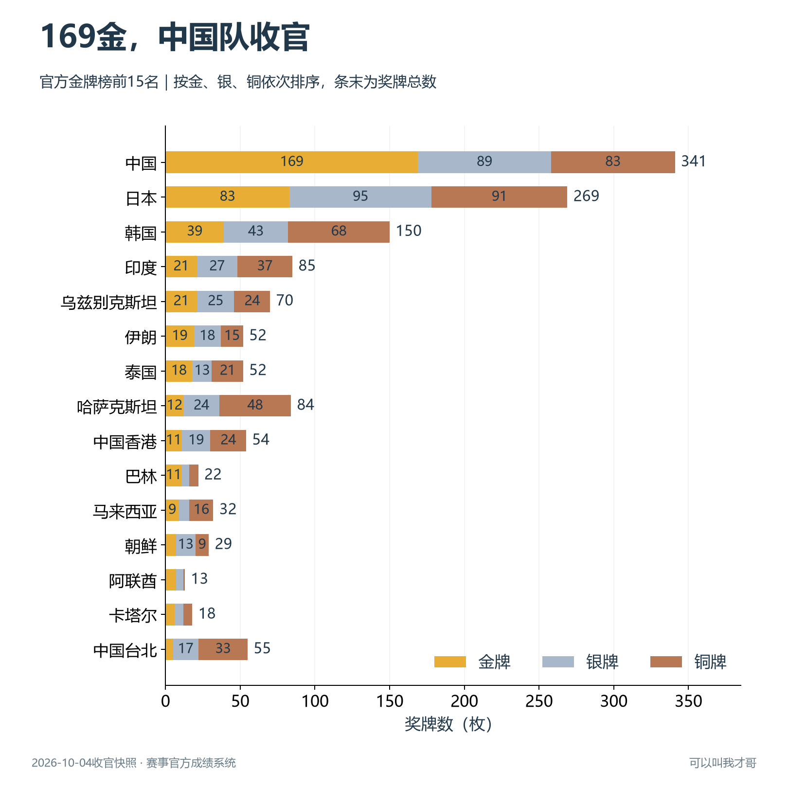
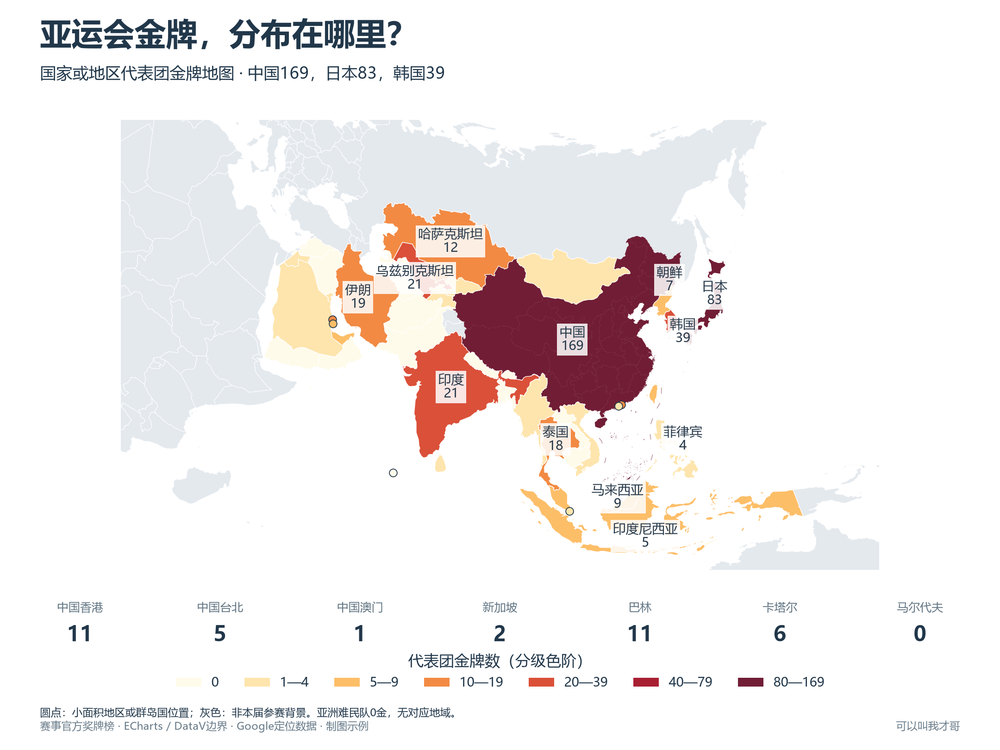
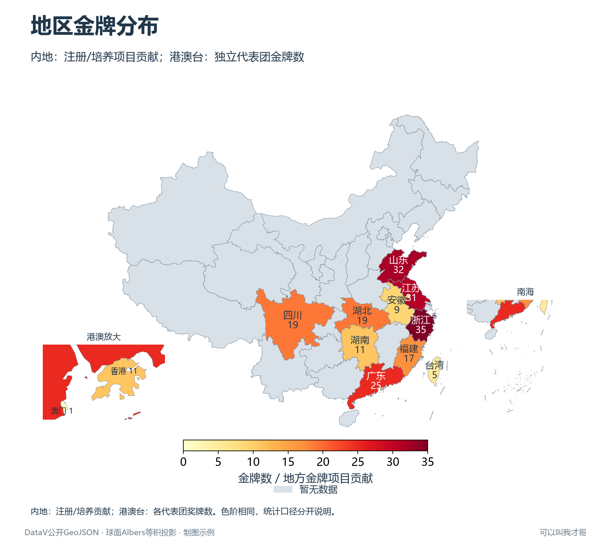

# 亚运会收官数据：采集、榜单与金牌地图

版本：v1.1.0；数据快照日期：2026-10-04；作者：才哥AGI。

本资料提供2026年爱知·名古屋亚运会46个代表团的完整奖牌榜、1,568条官方奖牌明细、参赛名单与51份简介样本字段核验、地区收官来源、34地区底表、七张静态图表与可复现Python代码。

## 快速运行

```powershell
python -m pip install -r requirements.txt
python 绘制图表.py
python 验收数据.py
```

默认使用随包官方JSON和CSV离线绘图，PNG和SVG输出至`配图`，900×383封面输出至`封面`。脚本按自身目录定位文件，可以从任意工作目录调用。已验证Python 3.14、pandas 3.0.6、Matplotlib 3.11.2、NumPy 2.5.3。Windows优先使用微软雅黑；其他系统安装Noto Sans CJK SC等中文字体。

重新访问公开来源：

```powershell
python 采集成绩.py
python 采集地区.py --online
python 采集补充.py --map --audit --refresh
python 生成地图映射.py
python 绘制图表.py
python 验收数据.py
```

`采集示例.py`提供两个接口的榜单入门示例；`采集成绩.py`完成46个代表团明细采集、前后榜单一致性检查和逐色奖牌校验。`官方接口.py`提供公开响应的解压、重试与原始快照记录。

## 统计范围与地区覆盖

官方参赛名单包含姓名、分项、代表团、性别、注册号及报名项目，没有籍贯、注册单位或培养地字段。已核对的51份中国运动员简介样本未发现这些结构化字段；简介履历中Location表示赛事举办地。省级图继续使用地方培养、输送成绩。`采集补充.py --audit`核对随包原始快照，加`--refresh`重新请求公开页面接口；报告区分报名行数与唯一运动员注册号，保存每份样本的字段和URL。

新增代表团金牌地图连接全部46个代表团的官方金牌数，45个有地理归属；亚洲难民队0金单列说明。以NOC显式映射至ECharts边界名称，港澳台采用DataV省级边界，中国内地统一使用CHN的169金。马尔代夫以Google公开坐标定位。小地区圆点尺寸固定，颜色按金牌数，面积不表达成绩。色阶分为0、1—4、5—9、10—19、20—39、40—79、80—169；灰色表示非本届参赛背景。

代表团榜单采用赛事官方金、银、铜排名，40个代表团有奖牌，6个代表团为零奖牌。CHN为169金89银83铜；HKG为11金19银24铜；TPE为5金17银33铜；MAC为1金4银1铜。

内地地区采用地方公开报道中的注册或培养输送运动员项目贡献。截至本次核验，浙江、山东、江苏、广东、四川、湖北、福建、湖南、安徽9省已有收官汇总，港澳台3个地区使用独立代表团官方奖牌数。34地区底表覆盖所有省级地区，12个地区金牌数据已有核验来源，另22个地区为待核验空值，覆盖率35.3%。广东银铜暂缺，保留空值。

地区条形图为已核验样本比较，港澳台独立面板显示代表团口径。地图同一色阶用于数量展示，灰色为待核验。当前资料支持已核验样本分析；形成全国最终省级排名需要补齐22个地区收官来源并统一地区统计规则。

地方团体项目贡献与代表团奖牌数分别解释。同一地区同一获奖事件计1项贡献，联合培养保留地方来源归属。`07_地区贡献口径.py`以江苏省体育局确认的男子50米步枪三姿团体冠军为例，展示江苏、陕西、山东各1项贡献，而CHN只有1条金牌记录。

## 文件与字段

|文件|内容|
|---|---|
|数据/国家地区奖牌榜.csv|46代表团，官方排名、金银铜、总数和中文名|
|数据/奖牌明细.csv|1,568条获奖记录；唯一键award_id、NOC、小项、奖牌、类型、日期|
|数据/官方原始/*.json|代表团、奖牌榜、分项和各代表团原始明细；来源元数据含URL、采集时间与SHA-256|
|数据/官方成员候选.csv|官方团体记录中的成员候选；标注requires_event_verification，支持后续按成绩册核验|
|数据/地区奖牌底表.csv|34地区行政代码、奖牌数、核验状态、来源和统计范围|
|数据/地区采集规则.csv|9个内地地区的来源与数字复核规则|
|数据/地区来源核验.json|地方来源发布单位、时间、已核验数字及抓取内容哈希|
|数据/金牌日期补核.csv|1条日期空缺的补核值、原因与国家体育总局来源|
|数据/中国省级边界.geojson|DataV公开省级多边形与岛屿边界|
|数据/世界边界.geojson|ECharts示例世界GeoJSON；来源与内容哈希随包保存|
|数据/代表团地图映射.csv|NOC、世界边界名称、行政代码、几何类型、小地区坐标和来源|
|数据/官方原始/参赛名单.json|官方名单快照，含运动员及组合报名记录|
|数据/运动员字段核验.json|名单字段统计及51份中国运动员简介样本的核验结果|
|数据/实获奖名单示例.csv|已核验的一个团体冠军及3个地区归属示例|
|数据/中国分项目金牌.csv|中国38个获金分项；总计169金|
|数据/每日金牌.csv|比赛日期×代表团新增金牌数|
|数据/代表团项目热力矩阵.csv|图中前10代表团×15分项对应矩阵|
|数据验收.json|数据、图表数量、中文覆盖、地区缺失值和日期核验结果|
|物料清单.json|文件尺寸及SHA-256|

`award_id`按Org、Disc、Event、Medal、Reg组合，识别一条获奖记录。团体奖牌计1条；同一小项可有多条获奖记录。男子100米蛙泳有两条金牌记录，470条金牌记录对应469个获金小项键，保留原始记录。

`date_raw`保留官方原始日期。现代五项男子个人CHN金牌的DateRaw为空，依据国家体育总局2026-09-20报道补核，`date_source`标注来源，其他日期使用official_medal_record。累计曲线终点逐代表团核对奖牌榜。

Members可能含更大参赛阵容，实际获奖人需核对项目成绩册、预赛/决赛和替补规则；候选表按其含义使用。地区底表来源为已核验地方收官汇总。

## 七张图怎么选择

|代码|图表|用途|
|---|---|---|
|01_代表团榜单.py|横向堆叠条形图|金牌排名与金银铜结构|
|08_代表团金牌地图.py|国家或地区代表团分级设色地图|全部代表团金牌的地理分布|
|02_地区榜单.py|两个面板的地区条形图|已核验注册/培养贡献及港澳台代表团对照|
|03_地区金牌地图.py|行政区分级设色地图|金牌数量地理分布及来源覆盖|
|04_项目热力矩阵.py|代表团×分项热力矩阵|各代表团夺金项目结构|
|05_中国金牌项目.py|分项条形图|中国金牌构成，前14分项136金，其他24分项33金|
|06_累计金牌.py|逐日累计折线图|中日韩金牌数量增长过程|







`图表工具.py`统一中文字体、颜色和PNG/SVG导出，使用球面Albers等积投影，标准纬线25°/47°、中央经线105°。地图保存多面、内环孔洞和島屿；港澳、南海放大图使用同一边界和色阶。底图为公开GeoJSON制图示例，实际使用时按用途选择合适的地图底图。

## 数据来源

赛事官方成绩入口：

https://results.asiangames2026.org/

https://back.results.asiangames2026.org/s/AG2026/en/ALL/medals/standings

https://back.results.asiangames2026.org/s/AG2026/en/ALL/orgs/list

https://back.results.asiangames2026.org/s/AG2026/en/ALL/medals/org/CHN

公开页面接口已按本次快照验证；后续页面接口变化时按Network请求重新确认路径和字段。地方网页先人工核验语义，再使用数字规则复核页面变化。刷新成功不等于新增地区自动核验，新增地区需补充SOURCES与证据。

浙江省委省政府贺电，北京青年报政知见刊载：

https://news.ifeng.com/c/8wwVw9j6OSL

山东卫视：

https://news.iqilu.com/shandong/shandonggedi/20261004/5949899.shtml

新华日报·交汇点江苏收官汇总：

https://sports.jschina.com.cn/jrtt/202610/t20261004_s6ac233ace4b02e2ec97f72aa.shtml

广州日报广东完整征程：

https://news.dayoo.com/sports/202610/04/140001_55009796.htm

四川日报·四川在线：

https://ent.scol.com.cn/ty/202610/83335218.html

湖北、福建、安徽省委省政府贺电，京报网刊载：

https://news.bjd.com.cn/2026/10/04/11983437.shtml

湖南日报：

https://www.hunantoday.cn/news/xhn/202610/33911919.html

江苏省体育局团体冠军及地区归属：

https://jsstyj.jiangsu.gov.cn/art/2026/9/25/art_40686_11835298.html

国家体育总局比赛日期补核：

https://www.sport.gov.cn/zjzx/n5197/c30058161/content.html

地图边界：

https://geo.datav.aliyun.com/areas_v3/bound/100000_full.json

https://echarts.apache.org/examples/data/asset/geo/world.json

小面积地区和群岛国定位坐标（Google Developers countries.csv）：

https://developers.google.com/public-data/docs/canonical/countries_csv

运动员参赛名单：

https://back.results.asiangames2026.org/s/AG2026/en/ALL/entries/list

运动员简介示例（公开字段BirthDateRaw表示生日，Location在Info比赛履历中表示举办地）：

https://back.results.asiangames2026.org/s/AG2026/en/SHO/entries/bio-info/8971814

新华社中国代表团收官成绩：

https://www3.xinhuanet.com/20261004/2d8b519b1c4f48d6a3eaf059969dc836/c.html
